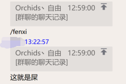

# astrbot_plugins_forwardmsgAnalysis

forwardmsgAnalysis：使用AI大模型来分析聊记录里面的文字内容来判断该聊天记录是不是符合“搬屎”当中"屎"的定义


 ## 依赖
本间插件依赖于napcat，调用了当中的api，仅限于使用了napcat的用户使用该插件。  
此外，该插件还需要提供合适的LLM大模型的API_KEY来使用，该插件使用了通义千问的API，需要提供对应的key才能正常运行。  
### 安装依赖库
```py
pip install dashscope
```

### 插件中对应的有关代码
```py

import dashscope
from dashscope import Generation

dashscope_api = "please fill in your api_key"

#调用部分：
dashscope.api_key = dashscope_api

response = Generation.call(
    model="qwen-max",  # 或者使用 qwen-turbo, qwen-plus 等
    messages=[
        {"role": "system", "content": "你是一个专业的文本分析助手"},
        {"role": "user",
         "content": "略"}
    ]
)

```

### 如果想要使用其他的LLM，请根据自行需求更改代码


## 插件原理和使用方法

### 原理：
本插件的原理是在触发指令之后，通过调用napcat的api，获取聊天记录当中的纯文字部分的内容，或者回复的纯文字内容当中的文字部分，并且整理成单独的一个字符串，加上预先设定好的角色和提示器，调用LLM模型让LLM来判断提取出原来的文本是否符合"屎"的定义。不论是否符合定义，都有指定的回复。  
**注意：在多层聊天记录嵌套的时候，为了速度等各种方面的原因，在提取文字的时候最多提取嵌套1层的聊天记录的文字内容，并且提取的行（一条信息为一行）最多为250行（可自行更改）。**

### 使用方法：
对着要搜索的聊天记录或者文字回复 **/fenxi** ，即可触发指令进行搜索。如果搜索出来是屎，就会回复你恢复的那条信息“这就是屎”。  

